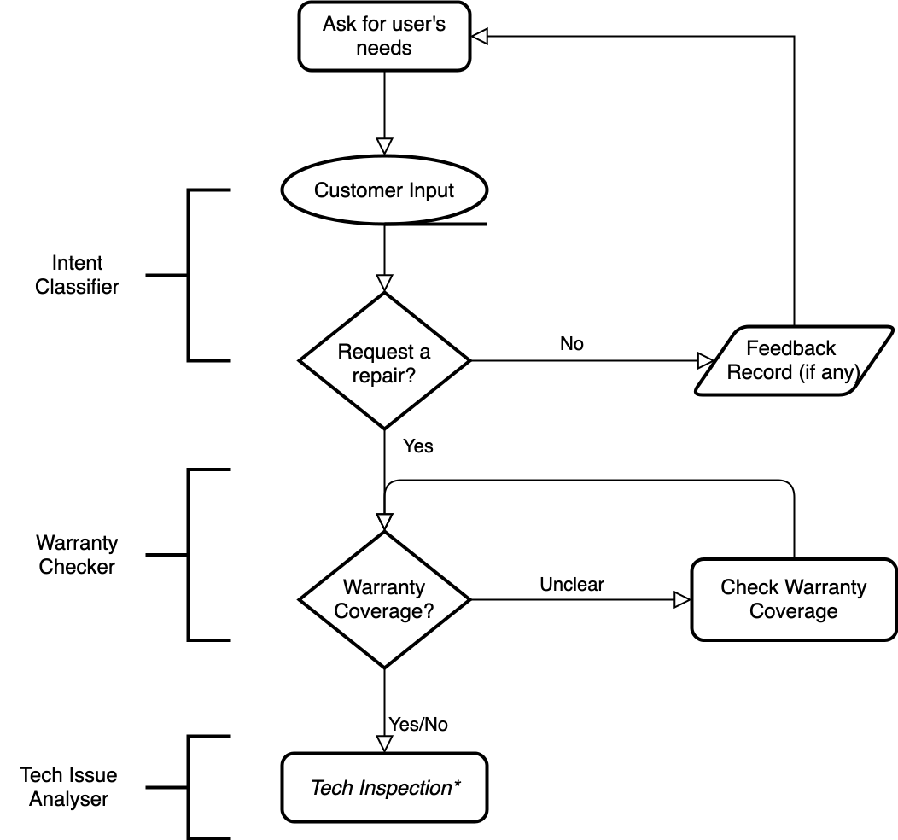
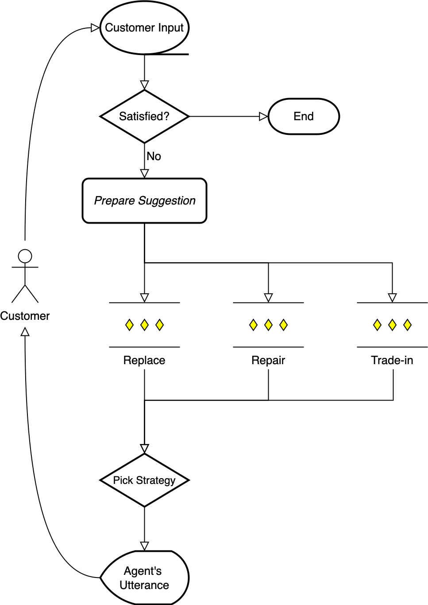
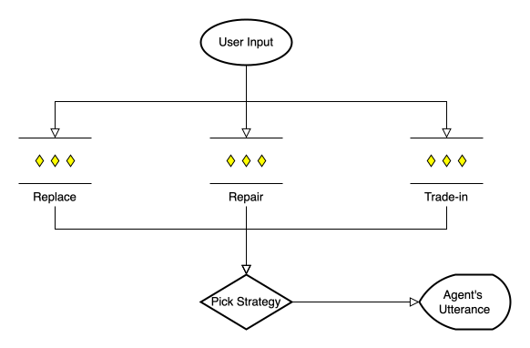
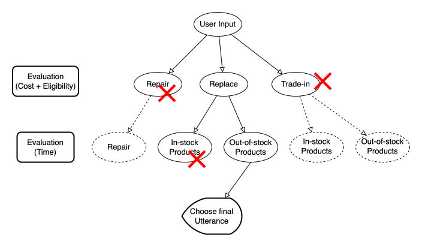
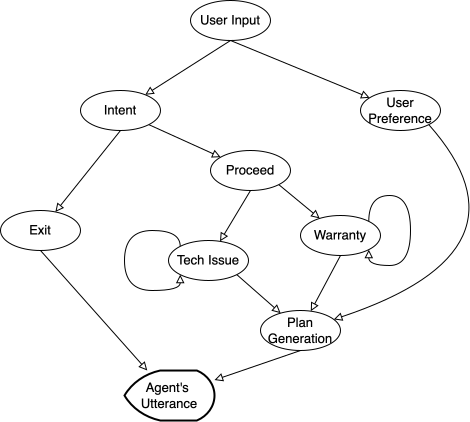

# XoT_Tutorial
A brief tutorial on Chain of Thoughts (CoT), Tree of Thoughts (CoT) and Graph of Thoughts (GoT).

## Scenario
Under the customer service scenario, an agent need to help the customer make suggestion to the user on whether to repair its device. This is not an easy task as the repairing fee could be high. If the repairing fee is close to buying a new one, trade-in the broken one and get a coupon might be a good choice.

To be specific, the agent need to figure out:
* Does the customer want to repair its device?
* If the customer do want to repair its device, give suggestions. It could be one of the following:
  * Repair the device, and pay the repairing fee.
  * Trade-in the device, and get a coupon for a brand new one.
* Note that the customer may purchased warrenty, which could significantly reduce the fee for a repair. That makes the decision making more complex.
* Besides, there are in-stock and out-of-stock items. The in-stock item can be picked up immediately, while the out-of-stock item need to be shipped and the user need to wait for a few days.

### Settings of the Customer Tutorial

The conversation flow is like the follows:

|      Basic Information Collection      |      Tech-details Enquiry      |
| :----------------------: | :-----------------------: |
|  |  |

Firstly, the agent need to collect some basic information. Then it need to proceed to multiple rounds of interaction about enquiring tech details, etc.

We will try to use different prompting strategies in different steps.

## Direct use of LLMs

LLMs may directly handle the user intent part, i.e., it may distinguish whether the user is would like to comment on the current product or would like to request for "after-sales service".

May consider designing a proper prompt for the LLMs to handle the user intent part. See `utils/intent_classifier.py` for implementation details.

<!-- > You are a customer service chatbot help to decide if the user want to repair its device. Base on the user's description, reply "Yes" if the user want to repair the device, "No" if the user do not want to repair the device, and "End" if the user want to end the conversation.  -->

## Chain of Thoughts (CoT)

Checking warranty coverage is more complex compared with checking intent. Basically, there are a few rules about warranty:
1. All products come with a 90-day warranty since purchase.
2. Customers can purchase additional warranty up to 2 years with an additional price. 

<!-- May consider the chain-of-though prompting, with background and fewshot examples:

#### Background: 
> You are a helpful agent that help to decide if a product is out of warranty. Note that all product come with a 90-day warranty since purchase. Customer can also purchase additional warranty that extends it to 2 years. Today is May 20th, 2024.

#### Warranty Checking Fewshot Examples -->

Practice CoT with fewshot examples. See the `utils/warranty_module.py` for implementation details.

## Self-consistent Tree of Thoughts (CoT-SC)

<!-- Multi-rounds of interaction. As user may also complain about the product at the same time when trying to get customer service, it would be great to collect user feedback at the same time. -->
 

We first need the user to describe the concrete problem of the tablet. Then we need to find out the best suggestion for the user:
1. Repair. The price for repairing each part of the tablet is:
   1. Screen: 120 USD.
   2. Charging port: 50 USD.
   3. Battery: 30 USD.
   4. Keyboard: 20 USD.
   5. Others: 60 USD.
2. Replace. If the tablet is within its warrenty, we can replace the tablet with a new one for free.
3. Trade-in. Give user an 100 USD coupon for a new tablet if the user trade-in the broken tablet.

> **Exercise**: *Change the Trade-in plan criterion. Give 50 USD coupon for major issue and 100 USD coupon for minor issue, if the user trade-in the broken tablet.*

Selection Criterion:
1. Ask LLM to decide.

> **Exercise**: *Change the selection criterion. Design your own selection criterion.*

## Tree of Thoughts (ToT)

Plan generation with ToT. This time we also need to consider the time cost of each plan.

We set up different time cost for in-stock and out-of-stock items. The in-stock item (space grey model) can be picked up immediately, while the out-of-stock item (black model) need to be shipped and the user need to wait for 7 days.

## Graph of Thoughts (GoT)

Reusing previous chains and add two more chains for the user to decide whether to repair the device and what to do if the device is out of warranty.

> **Exercise**: *Currently the `Tech issue` and `Warranty` node only self-iterate twice. Try to use your own self-iteration strategy.*