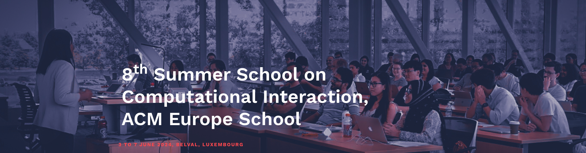

# 8th Summer School on Computational Interaction ACM Europe School 2024

 

This git repository accompanies the 8th  Summer School on Computational Interaction, ACM Europe School will be held at the University of Luxembourg, Belval campus, Luxembourg.  It will take place on June 03 - 07, 2024.

This summer school teaches HCI students, researchers, and industry professionals computational methods and their application in user interface design, interactive systems, user modeling, and more. Each day will feature one or two outstanding speakers who will share their expertise on a technical topic relevant to Computational Interaction. Individual lectures will give students an overview of different topics in Computational Interaction, and will include exercises that will give students hands-on experience with Computational Interaction research.

This Github page contains all materials for this year's summer school

The topics and speakers are as follows: 
- Day 1 (June 3rd) Opening Session: by Organizers and [ACM Europe Council](https://europe.acm.org/) representative. 
- Day 2 (June 4th) Lecture 1: Optimization methods for interface design and adaptation by [Anna Maria Feit](http://annafeit.de/) & [João Belo](https://www.linkedin.com/in/jo%C3%A3o-belo-8b5418204/)
- Day 2 (June 4th) Lecture 2: Modeling and understanding user interfaces from pixels by [ Amanda Swearngin](https://amaswea.github.io/)
- Day 3 (June 5th) Lecture 3: Charting the routes of thoughts in LLM-empowered conversational interactions by [Xiaojuan Ma](https://www.cse.ust.hk/~mxj/)
- Day 3 (June 5th) Lecture 4: Supporting rich interactions in mixed reality by [John Dudley](https://www.eng.cam.ac.uk/profiles/jjd50)
- Day 4 (June 6th) Lecture 5: Parameterization and Selection of Behavioural Models by [Gilles Bailly](https://hci.isir.upmc.fr/gilles-bailly/)
- Day 4 (June 6th) Lecture 6:Augmenting Ideation and Sensemaking in the age of LLMs: Concepts, Examples, and Opportunities from an HCI Perspective by [Gonzalo Ramos](https://www.microsoft.com/en-us/research/people/goramos/)
- Day 5 (June 7th) Lecture 7: Forward and inverse modelling in input by [John H. Williamson](https://www.gla.ac.uk/schools/computing/staff/johnwilliamson/)
- Day 5 (June 7th) [Closing Session](Day_5-Closing_Session/CIx%20Closing%20Session.pdf) : by Organizers

The school will be organized by:
- [Luis A. Leiva](https://luis.leiva.name/web/), University of Luxembourg, Luxembourg
- [Bereket A. Yilma](https://bekyilma.github.io/), University of Luxembourg, Luxembourg 

More Details at -- 
https://cixschool2024.uni.lu
